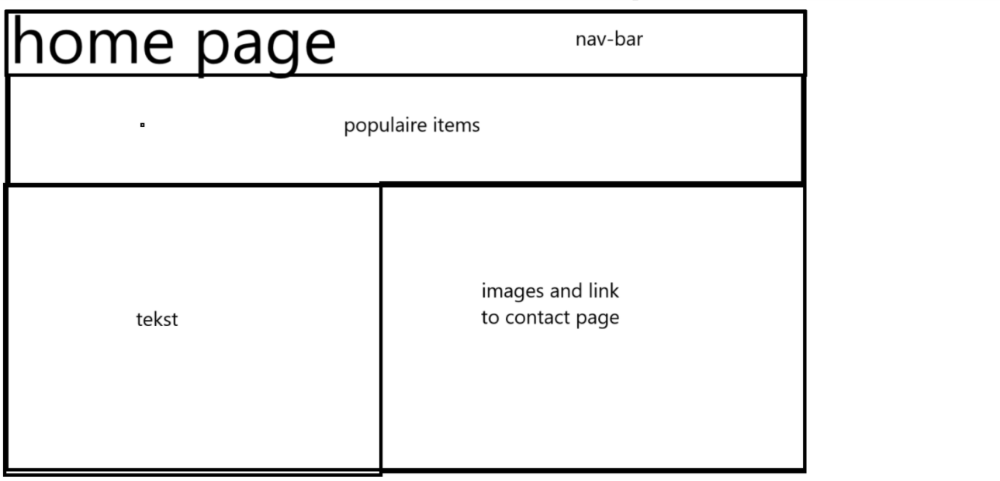
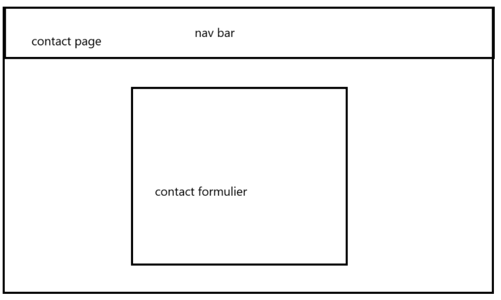
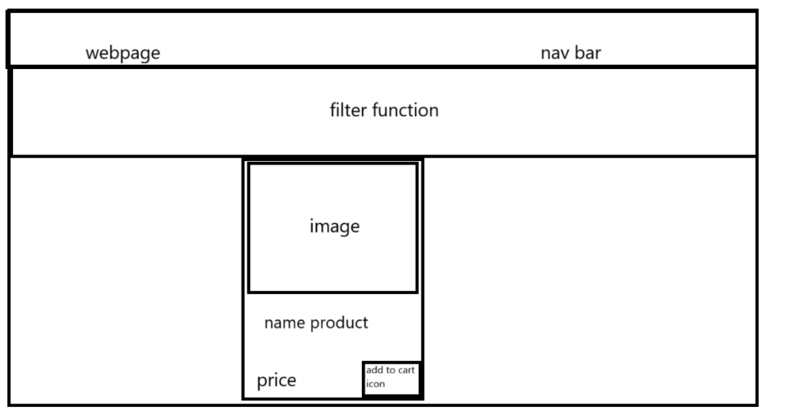
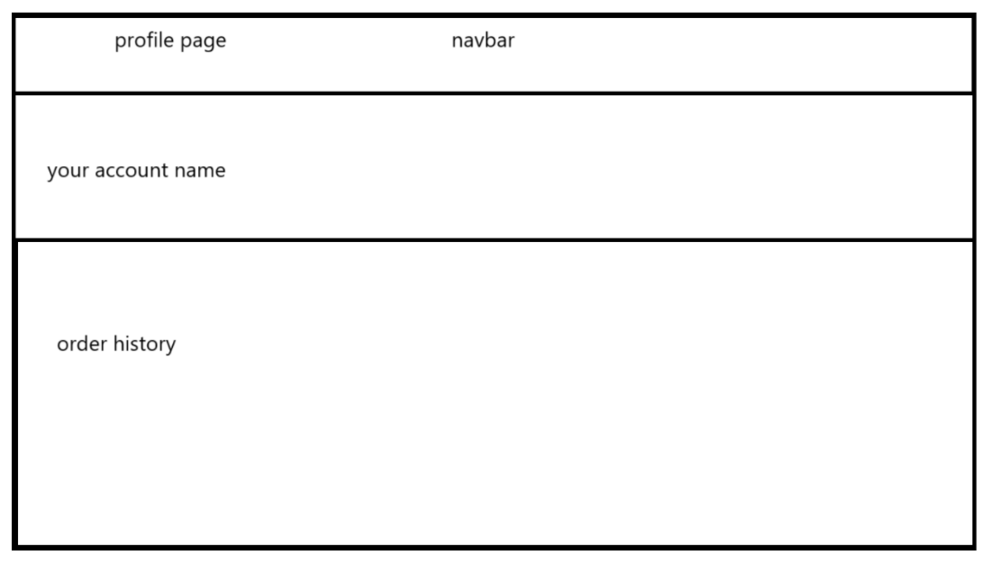

# Functional Design Document
Creative Webshop

# Description
I want to make a website where you can buy creative items and hobby supplies.

# Ambition
My ambition is to make a webshop, and for this project I want to learn and work with WordPress since I haven’t worked with it since my first year.

## Functional requirements
1. All the items are visible in the webshop: all items are shown on the page with an image, title, description, and price.
2. Click on the item: see a larger version with more information about the product.
3. Tags for the items: the tags make the items easier to find. Think about categories of
hobbies such as art, knitting, diamond painting, baking, and crafts. There can also be more detailed tags such as color, size, price, and product material.
4. Filter function: use the tags to sort products based on what you are looking for.
5. Working cart system: when you add something to your cart, the product will display with an image, title, and price. There will also be a "checkout system."
6. Working checkout system: you should be able to "checkout", clear your cart, and place your order in the database.
7. Homepage, webshop page, profile page, and contact page.

Homepage: contains information about the webshop and what I do, along with links to the contact page and webshop page.

Webshop page: shows all items, the filter function, cart, and checkout.

Contact page: allows visitors to ask questions or leave comments about the website or products.
8. Contact form: a form for contacting the webshop.
9. Contact form: a form for contacting the webshop.
10. View past orders: users can see their order history in their account.

## Non-functional requirements

### Performance
all the items should be loaded in the site within 2 seconds

### Usability

the user interface should be accessible to people with disabilities (lighthoues )

### Security
all the user information is encryted in the database 

--- 

